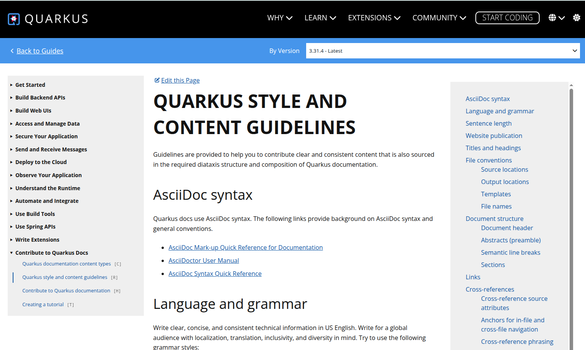
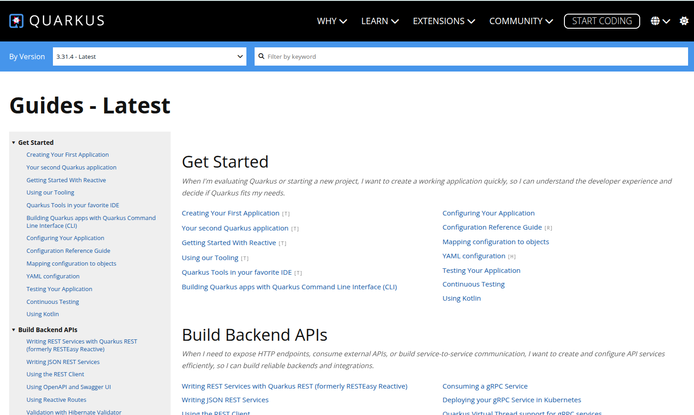

# Quarkus Guides Landing Page: JTBD Implementation Plan

## Summary

This plan proposes two changes to the Quarkus guides landing page:

1. **Reorganize 268 guides into 15 Jobs to Be Done (JTBD) domains** — so that a developer looking to "connect to a database" finds all relevant tutorials, how-to guides, references, and concepts in one place, rather than scattered across four Diataxis type sections.
2. **Replace the card grid with a persistent left sidebar** — so that developers can navigate between guides without returning to the landing page, addressing the core complaint in [GitHub issue #418](https://github.com/quarkusio/quarkusio.github.io/issues/418).

Phase 1 uses pure Jekyll (no external service changes). Phase 2 integrates the sidebar with the `search.quarkus.io` web components. The domain taxonomy retains Diataxis content types as secondary badges.

**Audience**: This document is for Quarkus documentation maintainers and stakeholders at the March 2026 F2F. [Part I](#part-i-the-proposal) presents the problem, the domain taxonomy, and success criteria. [Part II](#part-ii-implementation-spec) details the technical approach for whoever builds it.

**The ask**: Approve the Phase 1 implementation plan (Steps 1-5) and commit engineering time to execute it. The domain taxonomy presented here is a starting point — topic clusters and guide assignments will be refined collaboratively during Phase 1 implementation.

---

# Part I: The Proposal

## Problem Statement

The current guides landing page has two independent problems: **how guides are grouped** and **how users navigate between them**.

### The grouping problem

The landing page organizes 268 guides by Diataxis content type — Tutorials, How-to Guides, Concepts, References — plus a catch-all "General Guides" section that holds 185 of them (69%). Users don't arrive at docs thinking "I need a how-to guide." They arrive thinking "I need to connect my app to a database" or "I need to deploy to Kubernetes." The type-first layout forces them to guess which content type contains the guide they need, or to scroll through the catch-all.

The Jobs to Be Done (JTBD) framework fixes this by organizing documentation around **what users need to accomplish**. In the JTBD model, users *hire* documentation to get a job done. A job statement takes the form:

> "When [situation], I want to [motivation], so I can [expected outcome]."

The landing page answers "What do you need to do?" and routes users to domain-specific sections where all relevant content types live together under one roof. Diataxis types remain as secondary badges on each guide — they are useful metadata, not a useful organizing axis at this scale.

### The navigation problem

The landing page renders every guide as a tiled card in a responsive grid. This layout has three structural problems that compound as the guide count grows:

1. **Low information density.** Each card consumes ~80px of height for an icon, title, and summary. At 268 guides, this produces a page that requires extensive scrolling — the exact complaint filed in [GitHub issue #418](https://github.com/quarkusio/quarkusio.github.io/issues/418) (2020).
2. **No persistent navigation.** Once a user clicks into a guide, the card grid disappears. The only way back is the "Back to Guides" link. Contributor @alinnert reports keeping **12 browser tabs open** to work around this, and built a personal Obsidian vault to recreate the navigation structure Quarkus lacks.
3. **No cross-domain orientation.** A developer following a natural workflow (REST → CDI → Persistence → Security) must return to the landing page and visually re-scan the card grid at every step. As @alinnert puts it: *"I don't think you can eliminate the need to jump between different guides... But that's why a quick way to navigate between pages is so important."*

Every documentation site cited in issue #418 — Laravel, VitePress, Docusaurus, Stripe, Vert.x — uses a **persistent left sidebar** as its primary navigation mechanism. None use card grids for guide indexes.

## Proposed Solution

This plan addresses both problems:

| Problem | Fix | Mechanism |
|---|---|---|
| Grouping | **15 JTBD domain categories** | Guides grouped by user task (e.g., "Access and Manage Data"), not content type |
| Navigation | **Persistent left sidebar** | Collapsible domain tree visible on every guide page; domain-grouped list on the landing page |

The two changes are orthogonal — you could regroup the card grid without adding a sidebar, or add a sidebar without changing the grouping. This plan does both because the user feedback in issue #418 points to both problems simultaneously.

Phase 1 implements both changes using pure Jekyll — no external service changes. Phase 2 integrates the sidebar with the `search.quarkus.io` web components for search and filtering. See [Phase 2](#phase-2-interactive-sidebar) below.

### Wireframes

**Guide page** (sidebar + content + table of contents):

```
┌──────────────────────────────────────────────────────────────┐
│  ◂ Back to Guides          Version: 3.19 ▾      Edit ✎     │
├──────────────┬──────────────────────────────┬────────────────┤
│  SIDEBAR     │  GUIDE CONTENT               │  ON THIS PAGE  │
│  (2/12)      │  (7/12)                      │  (3/12)        │
│              │                              │                │
│ ▸ Get Start  │  # Configure data sources    │  • Datasource  │
│ ▾ Data       │                              │  • Hibernate   │
│   · Configure│  Configure your datasource   │  • Panache     │
│   · Hibern.. │  in application.properties:  │  • Flyway      │
│   ★ Panache  │                              │                │
│   · MongoDB  │  quarkus.datasource.db-kind  │                │
│   · Flyway   │    = postgresql              │                │
│   · Redis    │  quarkus.datasource.jdbc.url │                │
│ ▸ Security   │    = jdbc:postgresql://...    │                │
│ ▸ Deploy     │                              │                │
│ ▸ Messaging  │  [T] = tutorial              │                │
│ ▸ Observe    │  [H] = howto                 │                │
│ ▸ Runtime    │  [R] = reference             │                │
│   ...        │  [C] = concept               │                │
├──────────────┴──────────────────────────────┴────────────────┤
│  ◂ Previous: Use Hibernate ORM    Next: Use MongoDB ▸       │
│  Related: Use Panache · Configure Flyway migrations          │
└──────────────────────────────────────────────────────────────┘
```


**Landing page** (sidebar + domain-grouped list):

```
┌──────────────────────────────────────────────────────────────┐
│  [🔍 Search guides...]                    Version: 3.19 ▾   │
├──────────────┬───────────────────────────────────────────────┤
│  SIDEBAR     │  MAIN CONTENT                                 │
│  (all open)  │                                               │
│              │  ┌─────────────────────────────────────────┐  │
│ ▾ Get Start  │  │ 🚀 GET STARTED                          │  │
│   · Create.. │  │ Create your first app · Tooling · CLI   │  │
│   · Second.. │  └─────────────────────────────────────────┘  │
│   · Reactive │                                               │
│ ▾ Backend    │  ## Build Backend APIs                        │
│   · REST     │  "When I need to expose HTTP endpoints..."    │
│   · JSON     │                                               │
│   · Client   │  · Write REST services with Quarkus REST [H]  │
│ ▾ Web UIs    │  · Use the REST Client [H]                    │
│   · Qute     │  · Generate OpenAPI docs [H]                  │
│   · WS Next  │  · Build a gRPC service [H]                   │
│ ▾ Data       │  · Create a GraphQL API [T]                   │
│   · Config.. │  ...                                          │
│   · Hibern.. │                                               │
│   · Panache  │  ## Access and Manage Data                    │
│   · MongoDB  │  "When I need to connect to databases..."     │
│   ...        │                                               │
│ ▾ Security   │  · Configure datasources [H]                  │
│   ...        │  · Use Hibernate ORM [H]                      │
│              │  · Use Panache for simplified ORM [H]          │
│              │  ...                                          │
└──────────────┴───────────────────────────────────────────────┘
```

Key: `[T]` tutorial, `[H]` how-to, `[R]` reference, `[C]` concept. `★` = active page. `▸` = collapsed, `▾` = expanded.



**Guide page wireframe — what's new vs. existing**: The version selector, "Edit" link, and "Related guides" section already exist in the current layout. New elements introduced by this plan: the left sidebar (2/12 column), prev/next navigation footer, and Diataxis type badges.

**Landing page wireframe — what's new vs. existing**: The search bar already exists. New elements: the left sidebar, domain-grouped sections with job statements, compact guide lists with type badges, and the "Get Started" callout.

### JTBD Principles Applied to Quarkus Guides

| Principle | Application |
|---|---|
| **Organize by user job, not content type** | Domain categories replace Diataxis type sections as the primary axis |
| **Title with imperative verbs** | Tutorials: "Build...", "Create..."; How-to: "Configure...", "Deploy..."; Concepts: "Understand...", "Learn..."; References: descriptive, no verb |
| **No gerunds** | "Configure logging" not "Configuring logging"; "Build a native executable" not "Building a Native Executable" |
| **Focus on user outcomes** | "Protect a web application with OIDC" not "OpenID Connect authorization code flow mechanism for protecting web applications" |
| **Diataxis types become secondary labels** | Each guide retains its type (tutorial/howto/reference/concept) as a badge, but type is not the grouping axis |

---

## Proposed Domain Categories

The proposed 15-domain taxonomy — with JTBD job statements, full guide mapping tables, learning paths, scope notes, and cross-reference policies — is in the companion document [guides-landing-page-domains.md](guides-landing-page-domains.md). These domains are a starting point, not a final taxonomy. Step 1 of the implementation roadmap includes reviewing and refining each domain with subject matter experts before the taxonomy is committed to `domains.yaml`.

## Guide Distribution Summary

| Domain | Guide Count | Primary User Job |
|---|---|---|
| Get Started | 13 | First project setup, orientation, and language choice |
| Build Backend APIs | 31 | REST, gRPC, GraphQL, validation, fault tolerance |
| Build Web UIs | 6 | Templating, WebSockets, full-stack web |
| Access and Manage Data | 35 | Databases, ORM, caching, search, migrations |
| Secure Your Application | 40 | Authentication, authorization, identity |
| Send and Receive Messages | 21 | Kafka, AMQP, Pulsar, RabbitMQ, event bus |
| Deploy to the Cloud | 38 | Kubernetes, OpenShift, serverless, native, containers |
| Observe Your Application | 16 | Metrics, tracing, logging, health |
| Understand the Runtime | 22 | CDI, reactive, Vert.x, virtual threads, lifecycle |
| Automate and Integrate | 9 | Scheduling, mailer, Drools, Camel, CLI scripting |
| Use Build Tools | 13 | Maven, Gradle, CLI, packaging, test coverage |
| Use Spring APIs | 9 | Spring API compatibility |
| Write Extensions | 15 | Extension development, Dev UI, Dev Services |
| Contribute to Quarkus Docs | 4 | Documentation standards and workflow |
| Build AI Applications | 0 | LLM integration, RAG, AI services (placeholder) |
| **Total** | **271** | *(268 unique guides; 3 cross-referenced in a secondary domain — see [policy](#cross-reference-policy))* |

---

## Success Criteria

How we know the reorganization worked:

| Criterion | Measure | Target |
|---|---|---|
| **Issue #418 resolved** | Positive feedback from @alinnert, @nimo23, and @gsmet on the deployed changes | Close issue #418 |
| **Sidebar reachability** | Every guide is reachable from the sidebar within 2 clicks of the landing page | 268/268 guides |
| **Reduced tab-hopping** | Average "Back to Guides" navigations per session (Google Analytics) | Decrease vs. baseline |
| **Community reception** | Qualitative feedback on Zulip (#documentation) and GitHub Discussions within 30 days of launch | Net positive sentiment |
| **No domain confusion** | Pick 10 guides at random; a new Quarkus user can locate each one in the sidebar within 10 seconds | 9/10 success rate in usability spot-check |

Baseline analytics should be captured before Phase 1 deployment so that post-launch measurements have a comparison point.

---

## Risks and Mitigations

| Risk | Impact | Mitigation |
|---|---|---|
| **Build output size** | Each guide page includes a sidebar with ~268 `<li>` entries. At ~50 bytes per entry, that's ~13 KB of extra HTML per page, or ~3.5 MB across all 268 pages. | Acceptable for a static site. If problematic, compress with gzip (sidebar HTML is highly repetitive and compresses well). Phase 2 replaces static HTML with a dynamic component. |
| **Search integration** | Restyling `<qs-guide>` elements as compact list items changes the visual layout; verify that the search web component's show/hide filtering still works with the new CSS. | Add a manual test before launch: type a query in the search bar, confirm matching guides remain visible and non-matching guides are hidden. Test with domain `<section>` wrappers present — `<qs-target>` traverses descendants at any depth, but the new DOM nesting should be verified. |
| **Sidebar vertical length** | 15 collapsed `<summary>` elements plus the open section's guide list could exceed viewport height for large domains (Security has 40 guides). | Only the current domain opens by default; the rest are collapsed. 15 collapsed summaries occupy ~450px. The largest open domain (Security, 40 items) adds ~800px, totaling ~1250px — within a typical viewport with scrolling. |
| **Content freeze during rollout** | Step 5 (retitling) touches `.adoc` front matter across the main Quarkus repo, creating merge conflicts with concurrent guide work. | Retitle one domain at a time. Each batch is a small PR that merges quickly. Coordinate timing with the release train to avoid freeze periods. |

---

## Content Gaps Identified

These gaps are documented for future prioritization and are **not part of the Phase 1 deliverables**. After Phase 1 launches, file GitHub issues for each gap so they can be triaged and assigned independently.

Jobs that users likely need but have no dedicated guide:

| Missing Job | Domain | Suggested Content Type |
|---|---|---|
| "Understand when to choose reactive vs. imperative" | Understand the Runtime | concept |
| "Understand build-time vs. runtime in Quarkus" | Understand the Runtime | concept |
| "Migrate a monolith to Quarkus microservices" | Get Started | tutorial |
| "Debug a Quarkus application in dev mode" | Get Started | howto |
| "Use structured logging with JSON" | Observe Your Application | howto |
| "Set up a CI/CD pipeline for a Quarkus application" | Deploy to the Cloud | howto |
| "Deploy to AWS ECS/Fargate" | Deploy to the Cloud | howto |
| "Use Redis for session storage" | Access and Manage Data | howto |
| "Configure rate limiting" | Build Backend APIs | howto |
| "Handle file uploads with REST" | Build Backend APIs | howto |
| "Monitor Quarkus with Prometheus and Grafana (end-to-end)" | Observe Your Application | tutorial |
| "Choose between Hibernate ORM and Hibernate Reactive" | Access and Manage Data | concept |
| "Get started with LangChain4j" | Build AI Applications | tutorial |
| "Build a RAG pipeline" | Build AI Applications | tutorial |

---

## Reviewer Verification Checklist

Use these checks to independently verify the domain taxonomy:

- [ ] Pick 3 guides at random from [quarkus.io/guides](https://quarkus.io/guides/). Can you locate each one in the [domain tables](guides-landing-page-domains.md) within 10 seconds?
- [ ] Read any domain's job statement. Does it describe a real task you'd arrive at the docs to accomplish?
- [ ] Find one of the 3 cross-referenced guides. Is it clear which domain owns it and where the "See also" link goes?
- [ ] Open the Security domain (40 guides) in the [domain tables](guides-landing-page-domains.md). Does the learning path note give you a clear reading order?
- [ ] Check the "Build AI Applications" placeholder. Is it reasonable to reserve a domain for content that doesn't exist yet?
- [ ] Review the wireframes. Can you picture yourself using this layout to navigate between guides without opening 12 tabs?

---

# Part II: Implementation Spec

## Implementation Roadmap (Phase 1)

Phase 1 delivers the sidebar-based navigation using only Jekyll templates, Liquid includes, SCSS, and a small inline script. No changes to `search.quarkus.io` or the `qs-*` web components are required.

### Step 1: Define Domain Taxonomy

Formalize the 15 domain categories in a new `_data/domains.yaml` file:

```yaml
domains:
  - id: get-started
    title: "Get Started"
    job: "When I'm evaluating Quarkus or starting a new project..."
    order: 1
    guides:
      - url: /guides/getting-started
      - url: /guides/getting-started-reactive
      # ... ordered list of guide URLs
  - id: backend-apis
    title: "Build Backend APIs"
    job: "When I need to expose HTTP endpoints or build service-to-service communication..."
    order: 2
    guides:
      - url: /guides/rest
      - url: /guides/rest-json
      # ...
  # ... remaining 13 domains
```

Each domain entry carries an ordered list of guide URLs. This list drives both the landing page and the sidebar. The ordering within each domain is editorial: guides are grouped by **topic cluster** — a set of guides about the same technology or capability (e.g., the gRPC cluster within Backend APIs, or the Flyway cluster within Data). Within each cluster, tutorials lead, followed by concepts, how-to guides, and reference material. Clusters themselves are ordered by importance to the domain's primary job, with the most common user task first.

**Why topic clusters, not subdomains**: Several domains are large (Security has 40 guides, Deploy to the Cloud has 38, Data has 35). A natural instinct is to split these into formal subdomains — e.g., "OIDC," "JWT & OAuth2," "Authorization" within Security — each requiring its own click-to-expand in the sidebar. Topic clusters are preferable for three reasons:

1. **Fewer clicks to content.** A two-level hierarchy (domain → guide) means users expand one domain and scan a flat list. Adding a subdomain level forces two expansion decisions before any guide is visible. Navigation research consistently shows that broad-and-shallow beats narrow-and-deep for findability.
2. **Learning paths stay coherent.** Large domains have a curated learning path that reads as a single sequence across the whole domain. Subdomains would either fragment the path across multiple collapsed sections or require duplicating it in each subdomain.
3. **Lower editorial overhead.** Each subdomain would need a name, scope boundary, and guide assignment — all reviewed with subject matter experts. Topic clusters achieve the same visual grouping with only a guide ordering decision, not a naming and scoping decision.

In the sidebar, topic clusters are rendered as visual separators (a subtle subheading or whitespace break between groups) rather than collapsible sections. This gives scannability without depth. If user testing later shows that a specific domain is too long to scan comfortably, a subdomain level can be added for that domain alone — but topic clusters are the default.

`domains.yaml` stores only URLs, not titles. Titles are resolved at build time by looking up the URL in `quarkus.yaml` (see Step 2). This avoids duplicating title strings in two files — titles are authored once in `.adoc` front matter and flow through `quarkus.yaml` to the sidebar automatically.

**Source of truth**: In Phase 1, `domains.yaml` is the single authoritative source for domain membership. Guide `.adoc` files do not carry a `:domain:` attribute — domain assignments live only in `domains.yaml`, and the sidebar template reads from it directly. If a guide page needs to know its own domain (e.g., to open the right sidebar section), it is looked up from `domains.yaml` at build time, the same way titles are looked up from `quarkus.yaml`. In Phase 2, this relationship inverts: each `.adoc` file gains a `:domain:` attribute, and `domains.yaml` is generated from front matter. This requires a change to the Quarkus build's `YamlMetadataGenerator` (in the main `quarkus` repo) to propagate the `:domain:` attribute into `quarkus.yaml`, which the Jekyll site then reads. This keeps guide metadata co-located with guide content long-term while keeping Phase 1 simple.

**Review**: Before committing `domains.yaml`, each domain is reviewed with the relevant subject matter experts (typically the extension maintainers who own the guides in that domain). The review covers domain boundaries, guide assignments, topic cluster ordering, and learning path selection. This can be done asynchronously (e.g., a GitHub PR per domain or a shared document with inline comments).

**Deliverable**: `_data/domains.yaml`.

### Step 2: Build the Guide Sidebar

Create a Liquid include (`_includes/guide-sidebar.html`) that renders a left-hand `<nav>` from `domains.yaml`:

```html

  Detect the documentation version from the page URL.
  Versioned pages live at /version/X.Y/guides/...; all others use latest.
  This mirrors the version-detection logic in _layouts/guides.html.



  

  




  Build a URL→title lookup from the version-appropriate quarkus.yaml
  so domains.yaml doesn't need to duplicate title strings.



  
    
  


<nav class="guide-sidebar" aria-label="Guide navigation">
  
  <details open>
    <summary>{{ domain.title }}</summary>
    <ul>
      
        
        
          
        
        
        <li class="active">
          <a href="{{ entry.url }}">{{ title }}</a>
        </li>
        
      
    </ul>
  </details>
  
</nav>
```

**Title resolution**: `domains.yaml` stores only URLs. The template detects the current documentation version from the page URL (mirroring the existing version-detection logic in `_layouts/guides.html`) and builds a lookup from the version-appropriate `quarkus.yaml` to resolve each URL to its title. Guides that don't exist in a given version (i.e., the title lookup fails) are silently omitted from the sidebar — this prevents broken links on older version pages. The template runs once per guide page (268 times per build). The title lookup is a linear scan per entry, but the total iteration count is bounded — roughly 268 pages × 18 entries per domain × 268 index entries in the worst case. Build time impact should be measured by adding `guide-sidebar.html` to a test build before deployment. If build time becomes a concern, a Jekyll plugin can precompute a URL-to-title hash.

**Version behavior**: `domains.yaml` is not versioned — it lives at `_data/domains.yaml`, not under `_data/versioned/`. The domain structure reflects the `latest` release across all versions. This is acceptable for Phase 1: domain names and groupings change infrequently, and the title-lookup guard ensures that guides absent from an older version don't appear as broken links. If per-version domain files are needed, that's a Phase 2 concern.

Key design decisions:

- **`<details>/<summary>`** provides collapse/expand with zero JavaScript. The current guide's domain opens by default; all others are collapsed.
- **Active page highlighting** uses a Liquid comparison (`page.url == entry.url`) at build time, so no client-side JS is needed for the basic case.
- **Mobile behavior**: the sidebar hides below 768px (`display: none`). A "Browse all guides" link at the top of the guide content takes mobile users back to the landing page.
- **Accessibility**: The sidebar uses semantic HTML (`<nav>`, `<details>/<summary>`) for native keyboard and screen reader support. Implementation will add `aria-current="page"` to the active link and accessible labels to type badges.
- **Grid change** in `_layouts/guides.html`: the current `8/12 content + 4/12 TOC` becomes `2/12 sidebar + 7/12 content + 3/12 TOC`.

```html
<!-- Current layout -->
<div class="grid__item width-8-12 width-12-12-m"> ... </div>
<div class="grid__item width-4-12 width-12-12-m tocwrapper"> ... </div>

<!-- Phase 1 layout -->
<div class="grid__item width-2-12 hide-mobile guide-sidebar-wrapper">
  
</div>
<div class="grid__item width-7-12 width-12-12-m"> ... </div>
<div class="grid__item width-3-12 hide-mobile tocwrapper"> ... </div>
```

**Files changed**:

| File | Action |
|------|--------|
| `_includes/guide-sidebar.html` | New — sidebar Liquid template |
| `_layouts/guides.html` | Edit — add sidebar column to grid |
| `_sass/layouts/guides.scss` | Edit — add `.guide-sidebar` styles |

**Deliverable**: Persistent sidebar visible on all guide pages.

### Step 3: Redesign the Landing Page

Replace the type-grouped card grid in `_includes/index-docs.html` with a domain-grouped compact list. The new layout has two columns: a left sidebar (same `guide-sidebar.html` include, always expanded) and a main content area.

Main content structure:

1. **Search bar**: retain the existing `<qs-form>` search at the top
2. **"Get Started" callout**: the 3 most important first-timer guides, visually distinct
3. **Domain sections**: one `<section>` per domain, each containing:
   - Domain title as `<h2>` with an anchor (e.g., `#backend-apis`)
   - One-line job statement in `<p class="domain-job">`
   - Guide list as a compact `<ul>` — each `<li>` shows the guide title as a link plus a small Diataxis type badge (`T` `H` `R` `C`)
4. **Large domains** (>25 guides: Backend APIs, Data, Security, Deploy): add a "Recommended learning path" callout before each guide list

The `<qs-target>` wrapper remains around the static content so that the existing search web components continue to filter guide entries when a user types in the search bar. The `<qs-guide>` elements are restyled as compact list items via CSS — each guide retains its `<qs-guide>` wrapper and structured attributes (`type`, `title`, `keywords`, `categories`, `summary`) so that `<qs-target>` search filtering continues to work. The visual change from card grid to compact list is CSS-only (`qs-guide { display: list-item; }` instead of the current grid span); no web component modifications are needed.

**Files changed**:

| File | Action |
|------|--------|
| `_includes/index-docs-v2.html` | New — domain-grouped landing page |
| `_layouts/documentation.html` | Edit — switch to `index-docs-v2.html` (keep `index-docs.html` as fallback) |
| `_sass/layouts/documentation.scss` | Edit — add domain list styles |

**Deliverable**: New landing page with domain-grouped guide lists and sidebar.

### Step 4: Add Cross-Guide Navigation

At the bottom of each guide page, add a navigation footer:

1. **Previous / Next** links within the domain's guide ordering (driven by the ordered list in `domains.yaml`)
2. **"Related guides"** pulled from the existing `relations` data in `quarkus.yaml` (already rendered in `_layouts/guides.html` lines 71-111, currently showing "same extensions" and "same topics")

No new data source is needed — the existing `relations` data covers cross-domain links, and `domains.yaml` ordering covers intra-domain sequencing.

**Files changed**:

| File | Action |
|------|--------|
| `_layouts/guides.html` | Edit — add prev/next links above the existing related content section |

**Deliverable**: Prev/next navigation on every guide page.

### Step 5: Update Guide Titles

Apply JTBD-compliant titles to guide `.adoc` front matter. This changes the `:title:` attribute in each file but does **not** change URLs (the filename-based URL is preserved).

**Deliverable**: Updated `.adoc` titles matching the JTBD title column above.

---

## Phase 1 Estimated Effort

| Step | Dependencies |
|---|---|
| 1. Define domain taxonomy | None |
| 2. Build guide sidebar | Step 1 |
| 3. Redesign landing page | Step 1 |
| 4. Add cross-guide navigation | Step 2 |
| 5. Update guide titles | Step 1 |

Steps 2, 3, and 5 can run in parallel once Step 1 is complete. Step 4 depends on Step 2 (needs the sidebar and `domains.yaml` ordering). The critical path is: Step 1 → Step 2 → Step 4.

Each step produces an independent, revertible change. If community feedback is negative on the sidebar but positive on the domain grouping, the sidebar can be removed without unwinding the taxonomy.

---

## Phase 2: Interactive Sidebar

Phase 2 is contingent on Phase 1 adoption. It will be scoped as a separate proposal after Phase 1 has been deployed for at least one release cycle and community feedback has been collected. The section below describes the vision so reviewers understand where this work is heading, but Phase 2 is **not** part of the current approval request.

Phase 1 produces a static sidebar baked into every page at Jekyll build time. Phase 2 makes the sidebar dynamic by integrating it with the `search.quarkus.io` web component system.

### What Phase 2 adds

| Capability | How |
|---|---|
| **Search within the sidebar** | A `<qs-form>` input inside the sidebar filters the domain tree in real time |
| **Dynamic type/domain filtering** | Sidebar respects the category and type dropdowns from the filter bar |
| **Version-aware sidebar** | Sidebar content updates when the user switches documentation versions |
| **Synchronized highlighting** | The search web components highlight matching guides in the sidebar, not just on the landing page |

### Why it requires external changes

The `<qs-guide>`, `<qs-form>`, and `<qs-target>` web components are a Vue 3 application bundled from `search.quarkus.io` and cached locally at build time ([_plugins/copy-search-wc.rb](quarkusio.github.io/_plugins/copy-search-wc.rb)). Phase 2 requires either:

- **Extending the existing web components** to accept a sidebar DOM target and render filtered results into it, or
- **Creating a new `<qs-sidebar>` web component** that consumes the same search API and renders a collapsible nav tree

Either path requires coordinated changes to the `search.quarkus.io` service and the Jekyll site.

### Prerequisite

Phase 1 must be deployed and validated first. The static sidebar provides the editorial structure (domain ordering, guide grouping) that Phase 2 makes interactive. Launching Phase 2 without Phase 1 would mean building dynamic navigation over the current flat, type-based structure — which defeats the purpose.

---

# Appendix: Diataxis Type Reclassification

This appendix describes an independent effort to reclassify Quarkus guides by Diataxis content type. It is **not part of Phase 1 or Phase 2** — the sidebar and domain grouping work regardless of whether individual guides are typed as "tutorial," "howto," or the catch-all "guide." This effort can proceed on its own timeline.

## Background

Of 268 guides, 185 (69%) carry the catch-all type "guide." The remaining 83 are already classified: 38 reference, 16 tutorial, 15 howto, 14 concept. The type metadata is used for secondary badges on the landing page (`[T]` `[H]` `[R]` `[C]`).

Many of the 185 unclassified guides are genuinely multi-type documents — a common Quarkus pattern starts with a tutorial-style "Getting Started" walkthrough, transitions into howto configuration coverage, and ends with auto-generated reference tables. Forcing a single Diataxis type onto these documents is reductive.

## Approach

A preliminary scan of the 185 catch-all guides suggests three categories of work:

1. **Single-type guides** — roughly half of the catch-all guides appear to have a clear single type (tutorial, howto, reference, or concept). A reviewer validates the classification and updates the `:diataxis-type:` attribute in `.adoc` front matter. These are metadata-only changes.

2. **Borderline guides** — a significant minority require a reviewer to read the guide and decide. Most lean howto or reference.

3. **Mixed-type guides** — a substantial number contain content of 2+ Diataxis types in a single file (typically a tutorial introduction followed by reference material). For these, the recommendation is to **restructure the content into separate files**, each with a single type. Some of these are straightforward splits — for example, separating a tutorial walkthrough from an appended configuration reference section.

After splitting, each new file gets a JTBD-compliant title, a Diataxis type, and a place in the domain taxonomy. Cross-references between the split files (e.g., "For configuration details, see the [Hibernate ORM reference](/guides/hibernate-orm-reference)") help readers find and use the correct information. The domain taxonomy groups related guides together, and titles signal what each guide covers — so a reader looking at "Use Hibernate ORM" (tutorial) and "Hibernate ORM configuration" (reference) in the same Data domain can navigate between them naturally.

## Result

The single-type and borderline passes alone would substantially increase classified coverage. The mixed-type splits, done incrementally over time, would bring coverage to near 100%. The landing page shows type badges for classified guides and omits them for "guide" entries until they are reclassified.

## Criteria

- **Tutorial**: Walks the reader through building something from scratch with a defined outcome. Structural signal: "Prerequisites" section, "Solution" section, "Creating the Maven project" scaffolding.
- **Howto**: Assumes a working project and addresses a specific task. Structural signal: 8+ sections, 10+ code blocks, task-oriented headings, no tutorial scaffolding.
- **Reference**: Dominated by configuration tables, property lists, or API specs. Structural signal: `include::{generated-dir}/config/` directives, "Configuration Reference" heading.
- **Concept**: Explains how something works without prescribing actions. Structural signal: short (<200 lines), 2 or fewer code blocks, explanatory headings.
- **Guide (mixed)**: Contains substantial sections of 2+ types. The most common pattern is a tutorial introduction followed by reference material. The recommended action is to split into separate files.

